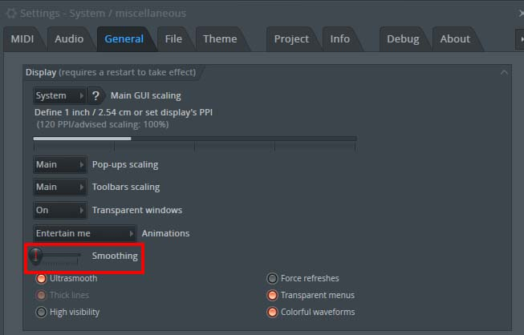

# FRUITY NILA – Installation & Setup
(Fruity Native Instruments Language Agent – MIDI script for FL Studio)

**Before You Begin:**  
Make sure you have:
- **Komplete Kontrol v2.3.0 or higher** ([Download](https://www.native-instruments.com/en/products/komplete/bundles/komplete-kontrol/))
- **Device Firmware 0.3.9 or higher** (Get updates from the [drivers page](https://www.native-instruments.com/en/support/downloads/drivers-other-files/))
- **FL Studio 2025 or higher**

## 1. Download and Unpack

- Download the latest release from:  
  [github.com/soundwrightpro/FRUITY-NILA/releases/latest](https://github.com/soundwrightpro/FRUITY-NILA/releases/latest)
- Unzip the downloaded file to reveal the `FRUITY-NILA` folder.

## 2. Install the Script

**Copy the entire `FRUITY-NILA` folder to:**

- **Windows:**  
  `Documents\Image-Line\FL Studio\Settings\Hardware\`

- **macOS:**  
  `~/Documents/Image-Line/FL Studio/Settings/Hardware`

  > **Tip:** If you have a previous Fruity NILA install, delete the old `Native Instruments` or `FRUITY-NILA` folder first.

## 3. Set Up in FL Studio

1. **Launch FL Studio.**
2. **Open MIDI Settings:**  
   Go to **Options → MIDI Settings** (or press `F10`).
3. **Assign MIDI ports:**  
   - Select your Komplete Kontrol device under Input and Output.
   - Assign the **same port number** to both Input and Output (the number can be anything, just not used by another device).
   - If using multiple controllers, each must be set to its own unique port.

    
    The GIF will loop when the setup is complete.

4. **Close MIDI Settings.**  
   Fruity NILA will auto-load whenever the controller is connected.

## 4. Recommended Settings

- For accurate knob smoothing and parameter control, check your **General Settings** in FL Studio as shown:

    

## 5. Quick Start: Using Fruity NILA

- The controller will instantly map to FL Studio’s mixer, channel rack, playlist, browser, plugins, and more.
- **Knobs**: Control track volume, pan, and plugin parameters.
- **Buttons**: Playback, undo, quantize, plugin picker, pattern/song switch, metronome, etc.
- **Wheel**: Context-aware navigation—scroll channels, move playhead, browse files, or switch UI windows (see User Manual for full mapping).
- **OLED Display**: Shows names, values, modes, and contextual info as you work.

## 6. User Settings

Edit the script’s behavior via `config.py`:

- **Windows:**  
  `Documents\Image-Line\FL Studio\Settings\Hardware\FRUITY-NILA\script\device_setup\config.py`
- **macOS:**  
  `~/Documents/Image-Line/FL Studio/Settings/Hardware/FRUITY-NILA/script/device_setup/config.py`

(See “User Adjustable Settings” in the [User Manual](../Fruity%20NILA%20User%20Manual.pdf) for options and details.)

## 7. Need Help?

- [Join the Fruity NI Discord for support, feedback, and feature requests.](https://discord.com/invite/GeTTWBV)

---

**For full button/knob reference, features, and troubleshooting, see the [Fruity NILA User Manual (PDF)](../Fruity%20NILA%20User%20Manual.pdf)**

---